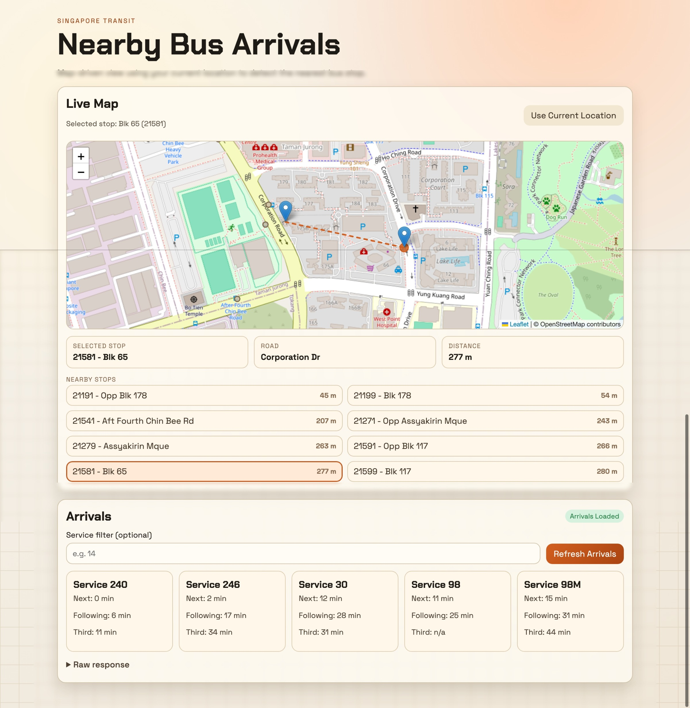

# Bus SG App

A lightweight bus transport web app that uses the gateway OpenAPI contract at:

- http://localhost:8067/openapi.json

The frontend is built with SvelteKit. It dynamically loads transport endpoints from the OpenAPI spec and calls them through a SvelteKit server hook proxy.

## Stack

- SvelteKit + Vite + Svelte 5
- Bun for package management and scripts

## Run

1. Ensure your API gateway is running at http://localhost:8067.
2. Install dependencies:

```bash
bun install
```

3. Start this app in development:

```bash
bun run dev
```

4. Open:

- http://localhost:3000

## Build and preview

```bash
bun run build
bun run preview
```

You can also use `bun run start` to run preview mode.

## Capacitor Mobile Targets

This project is now configured with Capacitor for native mobile targets.

### Included platforms

- Android project in `android/`
- iOS project in `ios/`

### Build and sync web assets to mobile

```bash
bun run mobile:build
```

### Sync only (after web changes)

```bash
bun run cap:sync
```

### Open native projects

```bash
bun run cap:open:android
bun run cap:open:ios
```

### One-time add platform commands (already done in this repo)

```bash
bunx cap add android
bunx cap add ios
```

### Android Studio dev/prod configuration

This project includes two Android build modes that prepare web assets and Capacitor config before opening/running in Android Studio.

Development mode (emulator/local API):

```bash
npm run android:dev
```

- Uses Vite `--mode development` (`.env.development`)
- Uses `androidScheme: http` to avoid mixed-content issues with local HTTP APIs
- Intended for Android emulator + local gateway (typically `http://10.0.2.2:8067`)

Production mode (deployed API):

```bash
npm run android:prod
```

- Uses Vite `--mode production` (`.env.production`)
- Uses `androidScheme: https`
- Intended for deployed HTTPS API endpoints

Then open and run in Android Studio:

```bash
npm run cap:open:android
```

Environment files used by these modes:

- `.env.development` -> `VITE_API_BASE` for emulator/local development
- `.env.production` -> `VITE_API_BASE` for production

Capacitor native HTTP patch is enabled in `capacitor.config.json` via `plugins.CapacitorHttp.enabled = true` to avoid WebView CORS issues on Android.

## Containerized run (Docker and Podman)

This project includes:

- `Dockerfile`
- `compose.yaml`
- `Makefile` wrapper for Docker Compose and Podman Compose

By default, the container expects your gateway at:

- `http://host.containers.internal:8067`

If you use Docker Desktop on macOS and need Docker host mapping instead, set:

- `API_ORIGIN=http://host.docker.internal:8067`

### Start with Docker Compose

```bash
make up ENGINE=docker
```

### Start with Podman Compose

```bash
make up ENGINE=podman
```

### Useful commands

```bash
make build ENGINE=docker
make logs ENGINE=docker
make ps ENGINE=docker
make down ENGINE=docker
```

You can replace `ENGINE=docker` with `ENGINE=podman` in all commands.

### Optional environment overrides

```bash
APP_PORT=3001 API_ORIGIN=http://host.docker.internal:8067 make up ENGINE=docker
```

## Screenshot



## Project structure

```text
src/
	app.css
	app.html
	hooks.server.js
	routes/
		+layout.svelte
		+page.svelte
svelte.config.js
vite.config.js
package.json
```

## Features

- Dynamic endpoint explorer built from OpenAPI paths under /api/v1/*
- Bus-focused endpoint filtering (Bus and Passenger Volume tags)
- Quick bus-arrival panel that uses your current location to resolve the nearest bus stop automatically
- Map view for current location and nearest resolved bus stop
- Tap-to-query map interaction: tap any point on the map to resolve nearest stops and load arrivals for that area
- Optional ServiceNo filter for arrival checks
- JSON response viewer
- Arrival board card view when the response includes Services
- Server-side proxying for `/api/*` and `/openapi.json`

## Config

Environment variables:

- `API_ORIGIN` (default: `http://localhost:8067`)

Example:

```bash
API_ORIGIN=http://localhost:8067 bun run dev -- --port 3001
```

## Cleanup note

Legacy files from the earlier custom Node static server version were removed.
